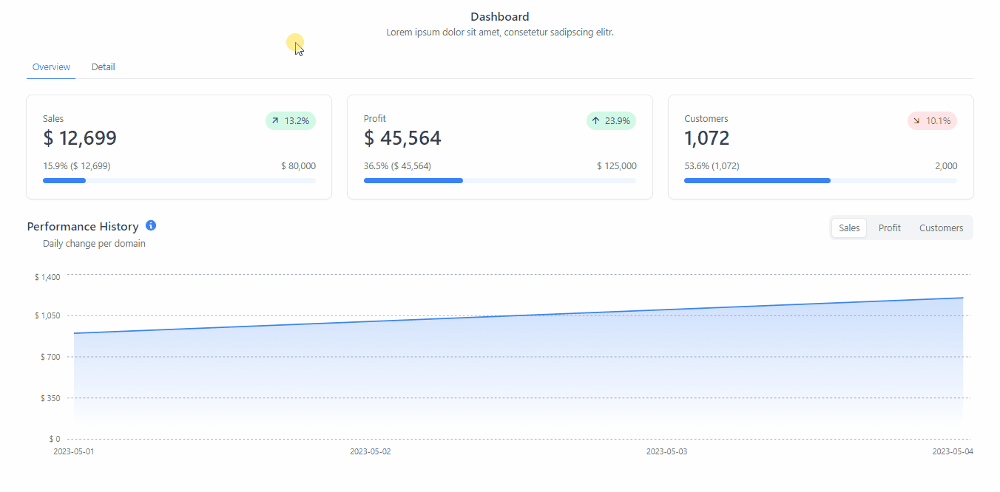

# Info

This repository represents a realization of the practical exercise of the following link [Create your first dashboard](https://www.tremor.so/docs/getting-started/demo-dashboard) and looks like this:



# 📊 React Tremor - Proyecto Demostrativo

Este repositorio contiene un proyecto demostrativo que utiliza **React Tremor**, una biblioteca para construir dashboards y visualizaciones de datos con React de manera rápida y sencilla.

## 📄 Descripción

El proyecto muestra cómo usar los componentes de React Tremor para crear paneles interactivos, gráficos y widgets de datos. Es ideal para aprender a integrar visualizaciones modernas y responsivas en aplicaciones React orientadas a la analítica.

## 📦 Contenido

- Código completo en React con React Tremor.
- Ejemplos de gráficos, tarjetas y tablas.
- Layout básico para dashboards.
- Documentación para extender con más widgets y datos.

## ⚙️ Requisitos

- [Node.js](https://nodejs.org/) versión 14 o superior.
- npm o yarn como gestor de paquetes.
- Navegador moderno para visualizar la aplicación.

## ▶️ Cómo ejecutar

1. Clonar el repositorio:

```bash
git clone https://github.com/tuusuario/react-tremor-demo.git
cd react-tremor-demo
```

2. Instalar dependencias:

```bash
npm install
```

3. Iniciar la aplicación:

```bash
npm start
```


4. Abrir en el navegador: `http://localhost:3000`

## 🎯 Objetivos

- Aprender a usar React Tremor para visualización de datos.
- Crear dashboards limpios y dinámicos.
- Integrar componentes gráficos y tablas responsivas.
- Sentar bases para proyectos analíticos con React.

---

Este proyecto es ideal para desarrolladores que buscan incorporar dashboards y visualizaciones modernas en React utilizando React Tremor.

---

¡Contribuciones, dudas y sugerencias son bienvenidas!

